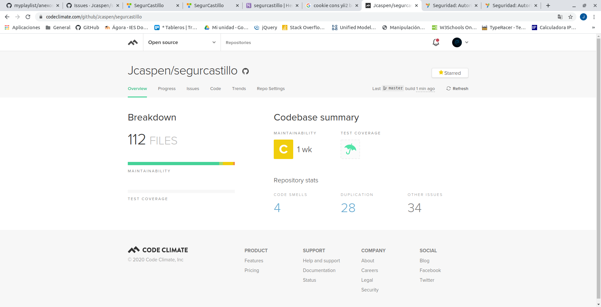

# Anexos

### *Prueba del seis*

1. ¿Qué sitio es éste?
- La aplicación tiene en todo momento elementos indicativos de que sitio es.
- La página principal y las demás tienen el logotipo de la empresa en el centro.

2. ¿En qué página estoy?
- Todas las páginas contienen las migas de pan por lo que sabemos en cada momento donde estamos.

3. ¿Cuales son las principales secciones del sitio?
- Las principales secciones del sitio son *Home*, *Vida*, *Empresas*, *Clientes* , *Hogar* , *No vida*, *Siniestros* , *Autos*(solo serán visibles si estamos logueados en la aplicación).

4. ¿Qué opciones tengo en este nivel?
- Dependiendo de si eres administrador, mediador o agente, podras crear, eliminar, modificar y ver los diferentes tipos de pólizas.

5. ¿Dónde estoy en el esquema de las cosas?
- En todas las páginas existe en la zona superior un indicador de bloque con las migas de pan.

6. ¿Cómo busco algo?
- Cada sección tiene su buscador propio.

---

### *([R26](https://github.com/jcaspen/segurcastillo/issues/26)) Code Climate*

### *([R25](https://github.com/jcaspen/segurcastillo/issues/25)) Codeception*

### *([R36](https://github.com/jcaspen/segurcastillo/issues/36)) Varios navegadores*

#### *Google Chrome*

---

#### *Mozilla Firefox*

---
