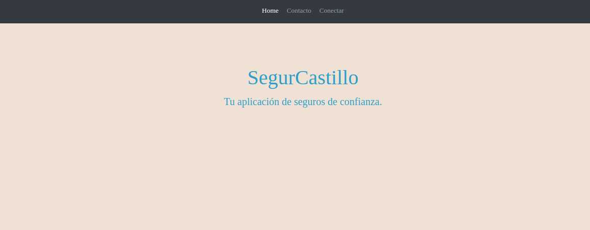
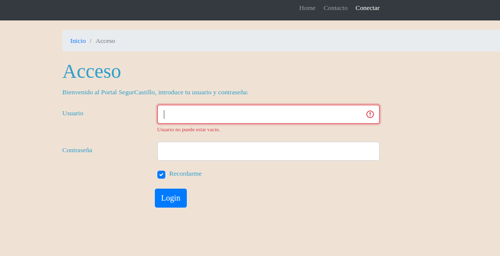
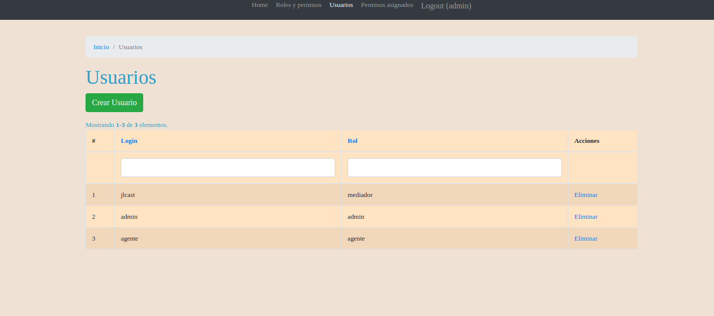
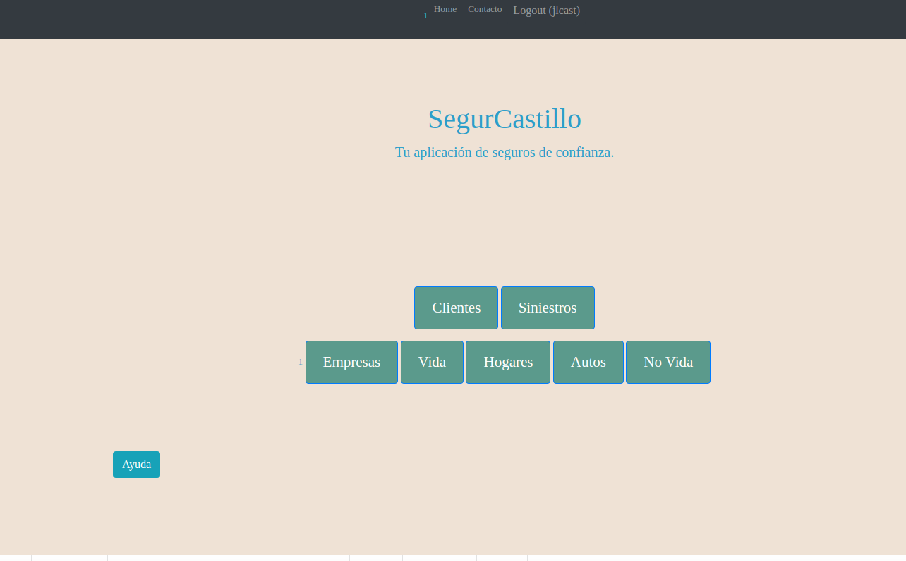
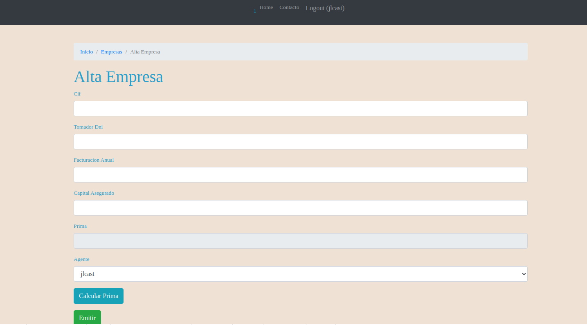
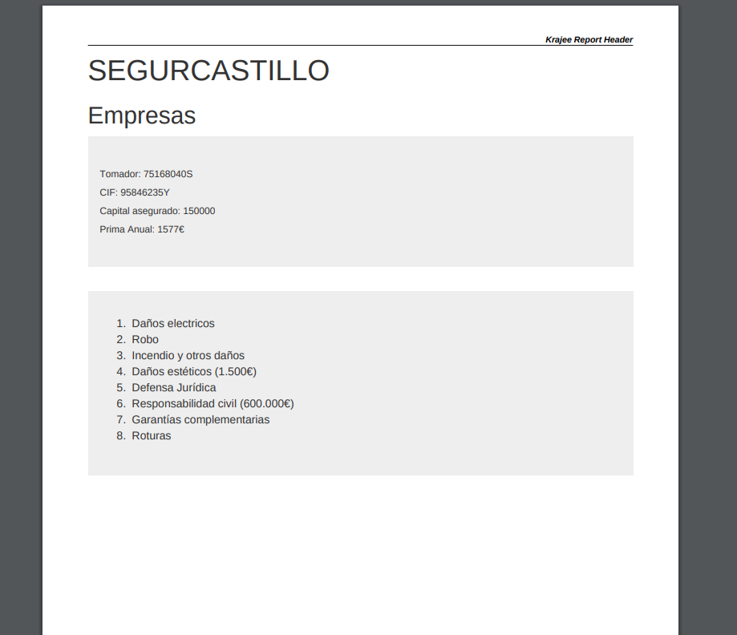

# Manual de usuario

En la página principal deberemos loguearnos para ver las opciones de nuestro rol

---

Una vez en la página de login nos logueamos

---
Por ejemplo el rol admin dispone de creación de usuarios y permisos

---
El rol mediador dispone de varias altas y opciones.

---
Para dar de alta una póliza simplemente rellenamos el formulario, damos a calcular póliza y emitimos.

Una vez este de alta nuestra empresa, podemos imprimir nuestra nueva Póliza.

